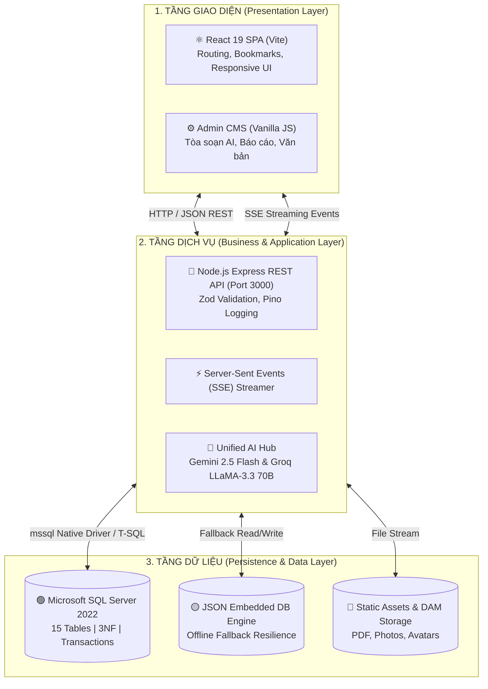

# 🇻🇳 HỆ THỐNG TRUYỀN THÔNG CÔNG ĐOÀN ĐẠI HỌC THỦ DẦU MỘT (TDMU) TÍCH HỢP TRÍ TUỆ NHÂN TẠO (AI)

[](https://react.dev/)
[](https://nodejs.org/)
[](https://www.microsoft.com/sql-server/)
[](https://ai.google.dev/)
[](https://vitest.dev/)

> **BÁO CÁO ĐỀ TÀI NGHIÊN CỨU KHOA HỌC SINH VIÊN / ĐỒ ÁN CƠ SỞ NGÀNH**  
> **Đơn vị quản lý:** Viện Công Nghệ Số – Trường Đại Học Thủ Dầu Một (TDMU)  
> **Giảng viên hướng dẫn:** ThS. Võ Quốc Lương  
> **Nhóm sinh viên thực hiện (Nhóm 2):**
> 1. **Nguyễn Bình Dương** (Nhóm trưởng) – MSSV: `2424802010319` – Lớp: D24CNTT05
> 2. **Trần Hồng Thanh** – MSSV: `2424802010439` – Lớp: D24CNTT03
> 3. **Phạm Anh Tuấn** – MSSV: `2324802010393` – Lớp: D23CNTT03

---

## 📌 1. TỔNG QUAN DỰ ÁN

Hệ thống **Truyền Thông & Quản Trị Công Đoàn TDMU Tích Hợp Trí Tuệ Nhân Tạo (AI)** là giải pháp chuyển đổi số toàn diện dành cho **Công đoàn Cơ sở Trường Đại học Thủ Dầu Một** (`congdoan.tdmu.edu.vn`).

Dự án bao gồm:
1. **Cổng thông tin Đoàn viên (React SPA):** Trang chủ, tin tức, chi tiết bài viết, kho văn bản & biểu mẫu, phúc lợi – đơn trợ cấp, cơ cấu tổ chức, liên hệ, giới thiệu và **Tủ sách đọc sau (Bookmarks)**.
2. **Tòa soạn AI Content Studio:** Sinh nội dung đa kênh (Website, Facebook, Zalo, kịch bản video, infographic) qua **Google Gemini / Groq LLaMA**, đồng bộ hóa với **Manus AI Copilot** soạn thảo thể thức hành chính.
3. **Phân hệ quản trị (Admin CMS):** Báo cáo tháng BM-02/CĐ, chấm điểm thi đua 16 Tổ Công đoàn, kho văn bản, hòm thư góp ý, hồ sơ tư liệu (DAM).
4. **Nền tảng dữ liệu:** Microsoft SQL Server chuẩn **3NF – 15 bảng**, với cơ chế dự phòng JSON khi SQL Server không khả dụng.

---

## 🏗️ 2. KIẾN TRÚC HỆ THỐNG (SYSTEM ARCHITECTURE)



---

## 🌟 3. CÁC PHÂN HỆ TÍNH NĂNG CHÍNH

### 🌐 A. Cổng Thông Tin Đoàn Viên (React SPA)
| Route | Chức năng |
|:---|:---|
| `/` | Trang chủ: tin tiêu điểm, luồng tin phong trào, văn bản mới |
| `/tin-tuc` | Danh mục tin tức (lọc chuyên mục, tìm kiếm, tab bài đã lưu) |
| `/bai-viet?id=...` | Đọc toàn văn bài viết, phản ứng, bình luận, đọc to (text-to-speech), lưu đọc sau |
| `/van-ban` | Kho văn bản chỉ đạo 4 chuyên mục, xem trước & tải PDF |
| `/phuc-loi-doan-vien` | 4 gói phúc lợi + gửi đơn đề nghị trợ cấp trực tuyến |
| `/co-cau-to-chuc` | Sơ đồ BTV, BCH, UBKT, 16 Tổ Công đoàn |
| `/bieu-mau`, `/lien-he`, `/gioi-thieu` | Biểu mẫu, danh bạ, giới thiệu |
| **PWA** | Service Worker hỗ trợ đọc offline; **Tủ sách đọc sau** lưu localStorage |

### 🤖 B. Tòa Soạn AI Content Studio (`/admin.html`)
* **Multi-Pass SSE Streaming:** sinh đồng thời 5 định dạng truyền thông đặc thù (5W1H, Facebook, Zalo, kịch bản video 60s, tóm tắt infographic).
* **Manus AI Copilot 2.0:** đũa thần nổi sửa văn bản trong `contenteditable`, **Safe-Zone Diff** so sánh trực quan, **AbortController** ngắt AI, phím tắt `Ctrl+Z` / `Ctrl+Y`.
* **Báo cáo tháng BM-02/CĐ:** số hóa biểu mẫu, chấm điểm và xếp loại thi đua 16 Tổ Công đoàn (`admin.html#reports`).

### 🗄️ C. Nhóm công nghệ & chất lượng mã nguồn
* **Backend:** Node.js + Express 4, `mssql` (SQL Server 2022), **Zod** validation, **Pino / pino-http** logging, dotenv.
* **Frontend:** React 19 + Vite, React Router, Bootstrap 5 (CDN), Font Awesome.
* **Kiểm thử:** Vitest + Supertest (15 test cases), mã nguồn checkout bằng **oxlint**.

---

## 🗄️ 4. CƠ SỞ DỮ LIỆU CHUẨN 3NF (15 BẢNG MÃ TIẾNG ANH)

Toàn bộ bảng sử dụng **định danh tiếng Anh** (tên bảng, tên cột); dữ liệu lưu trữ giữ nguyên tiếng Việt.

| STT | Bảng | Mục Đích Nghiệp Vụ | Khóa Ngoại (FK) |
|:---:|:---|:---|:---|
| **1** | `TO_CHUC` | Quản lý 5 Ban cấp Trường (BTV, BCH, UBKT, Nữ công, Tuyên giáo) | Tham chiếu bởi `NHAN_SU` |
| **2** | `TO_CONG_DOAN` | 16 Tổ Công đoàn trực thuộc | Tham chiếu bởi `NHAN_SU`, `MONTHLY_REPORTS` |
| **3** | `NHAN_SU` | Danh bạ cán bộ, giảng viên, đoàn viên | `MaToCongDoan` → `TO_CONG_DOAN`, `MaToChuc` → `TO_CHUC` |
| **4** | `CATEGORIES` | Chuyên mục bài báo | Tham chiếu bởi `ARTICLES` |
| **5** | `ARTICLES` | Bài viết, nội dung đa kênh AI, lượt xem | `MaTacGia` → `NHAN_SU`, `CategoryId` → `CATEGORIES` |
| **6** | `DOCUMENTS` | Văn bản chỉ đạo 4 loại | `MaNguoiDang` → `NHAN_SU` |
| **7** | `MONTHLY_REPORTS` | Báo cáo tháng & thi đua theo BM-02/CĐ | `MaToCongDoan` → `TO_CONG_DOAN`, `MaNguoiBaoCao` → `NHAN_SU` |
| **8** | `SCHEDULES` | Lịch hẹn giờ xuất bản đa kênh | `ArticleId` → `ARTICLES` |
| **9** | `USERS` | Tài khoản & phân quyền 3 vai trò | `MaNhanSu` → `NHAN_SU` |
| **10** | `ARTICLE_AUDITS` | Vết tác nghiệp biên tập & duyệt bài | `ArticleId` → `ARTICLES`, `UserId` → `USERS` |
| **11** | `COMMENTS` | Bình luận đoàn viên | `ArticleId` → `ARTICLES`, `UserId` → `USERS` |
| **12** | `BOOKMARKS` | Tủ sách đọc sau | `ArticleId` → `ARTICLES`, `UserId` → `USERS` |
| **13** | `PHUC_LOI` | Các gói chăm lo phúc lợi | Tham chiếu bởi `DON_TRO_CAP` |
| **14** | `DON_TRO_CAP` | Đơn đề nghị trợ cấp & theo dõi phê duyệt | `PhucLoiId` → `PHUC_LOI`, `MaNhanSu` → `NHAN_SU` |
| **15** | `INBOX_FEEDBACK` | Hòm thư góp ý, phản ánh gửi BCH | `MaNhanSu` → `NHAN_SU`, `NguoiXuLy` → `USERS` |

> Script DDL/DML chuẩn nằm trong `database/`:
> - `database/schema_15_tables_mssql.sql` — tạo 15 bảng, khóa ngoại, ràng buộc CASCADE/SET NULL.
> - `database/seed_15_tables_mssql.sql` — nạp 16 Tổ CĐ, cơ cấu tổ chức, cán bộ, tin tức, văn bản, gói phúc lợi.

---

## 📡 5. DANH MỤC API ENDPOINTS

| Nhóm Nghiệp Vụ | Phương Thức | Endpoint | Chức Năng |
|:---|:---:|:---|:---|
| **Tin tức** | `GET` | `/api/articles` | Danh sách bài viết (lọc `status`, `category`, `search`) |
| | `GET` | `/api/articles/:id` | Chi tiết bài viết |
| | `POST` | `/api/articles` | Thêm bài viết (Zod validation) |
| | `PUT` / `DELETE` | `/api/articles/:id` | Cập nhật / xóa bài viết |
| | `GET` / `POST` | `/api/articles/:id/reactions` | Phản ứng cảm xúc bài viết |
| **Văn bản** | `GET` | `/api/documents` | Danh sách văn bản (lọc `category`, `search`) |
| | `POST` | `/api/documents` | Đăng tải văn bản |
| | `DELETE` | `/api/documents/:id` | Xóa văn bản |
| **Tổ chức** | `GET` | `/api/org-full-tree` | Cây tổ chức (boards, units, cadres) + thống kê |
| | `GET` | `/api/trade-unions` | Danh sách 16 Tổ Công đoàn |
| | `GET` | `/api/categories` | Danh mục chuyên mục |
| **Báo cáo** | `GET` | `/api/monthly-reports` | Báo cáo tháng 16 Tổ CĐ |
| **Phúc lợi** | `GET` | `/api/welfare` | Danh mục gói phúc lợi |
| | `POST` | `/api/welfare/apply` | Gửi đơn đề nghị trợ cấp |
| | `GET` | `/api/welfare/applications` | Danh sách đơn trợ cấp |
| **Liên hệ / Góp ý** | `POST` | `/api/feedback` | Gửi góp ý tới BCH |
| **Bookmarks** | `GET` / `POST` | `/api/bookmarks` | Tủ sách đọc sau |
| **AI Studio** | `POST` | `/api/generate-article` | Sinh bài báo đa kênh (SSE) |
| | `POST` | `/api/ai/copilot` | Trợ lý Manus Copilot |

> **Ghi chú:** Dữ liệu trả về của `/api/documents` sử dụng khóa tiếng Anh: `id`, `reference_number`, `title`, `category`, `category_name`, `issuer`, `issued_date`, `signer`, `file_url`, `file_size`, `download_count`.

---

## 💻 6. YÊU CẦU MÔI TRƯỜNG & CÔNG NGHỆ

* **Hệ điều hành:** Windows 10/11, macOS, Ubuntu 22.04+.
* **Runtime:** Node.js `>= 18` (khuyến nghị LTS 20).
* **CSDL:** Microsoft SQL Server 2019/2022 — chạy qua **Podman** hoặc Docker trực tiếp.
* **Gói server:** `express`, `mssql`, `cors`, `dotenv`, `zod`, `pino`, `pino-http`.
* **Gói frontend:** `react`, `react-dom`, `react-router-dom`, `vite`, `oxlint`.
* **Phát triển:** `concurrently`, `vitest`, `supertest`, `pino-pretty`.

---

## 🚀 7. HƯỚNG DẪN CÀI ĐẶT & VẬN HÀNH

### Bước 1: Cài đặt dependencies
```bash
npm install          # cài cả root + frontend (scripts.setup)
```

### Bước 2: Khởi chạy Microsoft SQL Server (Podman khuyến nghị)
```bash
npm run db:up       # podman/docker-compose khởi tạo SQL Server 2022
npm run db:reset    # tạo lại database + nạp schema & seed (xóa dữ liệu cũ)
```

> Cấu hình kết nối được đọc từ `.env` (xem `.env.example`):
> ```env
> PORT=3000
> DB_SERVER=localhost
> DB_DATABASE=TDMU_TradeUnion_DB
> DB_USER=sa
> DB_PASSWORD=YourStrongPassword@2026
> DB_PORT=1433
> GEMINI_API_KEY=AIzaSy...
> GROQ_API_KEY=gsk_...
> ```

### Bước 3: Chạy hệ thống
```bash
npm run dev          # server :3000 + Vite :5173 (dev)
npm run build        # build React SPA vào frontend/dist
npm start            # chạy production server (phục vụ cả frontend đã build)
```

### Bước 4: Truy cập
* 🌐 **Cổng Đoàn viên (React SPA):** [http://localhost:3000](http://localhost:3000) *(hoặc* `http://localhost:5173` *khi dùng Vite dev)*
* ⚙️ **Tòa soạn AI & Admin CMS:** [http://localhost:3000/admin.html](http://localhost:3000/admin.html)
* 📊 **Báo cáo tháng 16 Tổ:** [http://localhost:3000/admin.html#reports](http://localhost:3000/admin.html#reports)

> Nếu SQL Server chưa khả dụng, hệ thống tự chuyển sang **JSON fallback** (`server/database.json`) nên mọi tính năng vẫn hoạt động.

---

## 🧪 8. KIỂM THỬ & CHẤT LƯỢNG

```bash
npm test             # chạy bộ kiểm thử Vitest + Supertest (15 test cases)
npm run lint         # oxlint toàn bộ mã nguồn frontend
```

Bộ kiểm thử phủ các API chính: articles (danh sách/chi tiết/404), documents (khóa tiếng Anh + lọc chuyên mục), org-full-tree, categories, welfare (+ validation 400), monthly-reports, feedback (+ validation 400), và cơ chế JSON 404 cho endpoint không tồn tại. Dữ liệu fallback được khôi phục tự động sau khi chạy test.

---

## 📂 9. CẤU TRÚC DỰ ÁN

```text
tdmu-congdoan-web/
├── database/                          # Kịch bản SQL (MSSQL)
│   ├── schema_15_tables_mssql.sql     # DDL 15 bảng, khóa ngoại
│   └── seed_15_tables_mssql.sql       # DML dữ liệu khởi tạo chuẩn
├── frontend/                          # React 19 SPA (Vite)
│   ├── src/
│   │   ├── App.jsx / main.jsx         # Router & Entry Point
│   │   ├── pages/                     # Home, TinTuc, BaiViet, VanBan, ...
│   │   ├── components/                # Header, Footer, Sidebar, BookmarksDrawer
│   │   └── lib/                       # Utilities (bookmarks.js, ...)
│   └── public/                        # Admin portal assets, css, js, images
├── public/                            # Admin CMS (admin.html, bao-cao-thang.html)
│   ├── admin.html                     # Tòa soạn AI Content Studio
│   └── js/admin/                      # Logic quản trị, báo cáo
├── server/                            # Backend Node.js Express
│   ├── server.js / app.js             # Khởi động & cấu hình Express
│   ├── mssql_db.js                    # Tầng truy vấn SQL Server + fallback
│   ├── routes/                        # ai, articles, documents, welfare, ...
│   ├── middleware/validate.js         # Zod validation
│   ├── logger.js                      # Pino logging
│   ├── database.json                  # JSON fallback engine
│   ├── scripts/init-db.js             # Khởi tạo CSDL (hỗ trợ --drop)
│   └── app.test.js                    # Vitest + Supertest
├── scripts/compose.mjs                # Podman/Docker Compose runner
├── compose.yaml                       # SQL Server 2022 container
├── package.json                       # Scripts & dependencies
└── README.md
```

---

## 👥 10. THÔNG TIN NHÓM THỰC HIỆN

| Họ và Tên | Mã Số SV | Lớp | Vai Trò |
|:---|:---:|:---:|:---|
| **Nguyễn Bình Dương** | `2424802010319` | D24CNTT05 | **Nhóm trưởng** – Kiến trúc CSDL 3NF (MSSQL), Backend REST API, AI Content Studio & SSE Pipeline |
| **Trần Hồng Thanh** | `2424802010439` | D24CNTT03 | **Thành viên** – Giao diện Cổng đoàn viên (React SPA & Portal), module Báo cáo tháng BM-02/CĐ |
| **Phạm Anh Tuấn** | `2324802010393` | D23CNTT03 | **Thành viên** – Kho văn bản pháp quy, quản lý tài nguyên số (DAM), dữ liệu kiểm thử |

---

*© 2026 Nhóm 2 – Đồ án Cơ sở ngành / NCKH Sinh viên – Viện Công Nghệ Số, Trường Đại học Thủ Dầu Một.*