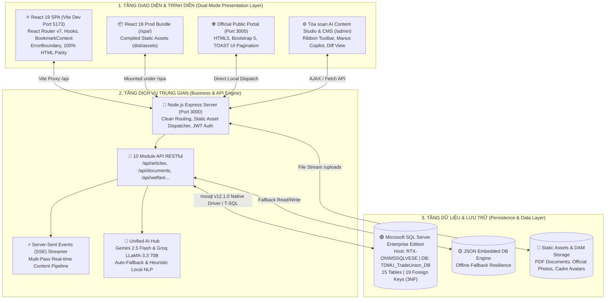

# 🇻🇳 HỆ THỐNG TRUYỀN THÔNG CÔNG ĐOÀN ĐẠI HỌC THỦ DẦU MỘT (TDMU) TÍCH HỢP TRÍ TUỆ NHÂN TẠO (AI)

[](https://react.dev/)
[](https://nodejs.org/)
[](https://www.microsoft.com/sql-server/)
[](https://ai.google.dev/)
[](#-4-kiến-trúc-cơ-sở-dữ-liệu-chuẩn-3nf-15-bảng--19-khóa-ngoại)
[](#-9-thông-tin-nhóm-thực-hiện)

> **BÁO CÁO ĐỀ TÀI NGHIÊN CỨU KHOA HỌC SINH VIÊN / ĐỒ ÁN CƠ SỞ NGÀNH**  
> **Đơn vị quản lý:** Viện Công Nghệ Số – Trường Đại Học Thủ Dầu Một (TDMU)  
> **Giảng viên hướng dẫn:** ThS. Võ Quốc Lương  
> **Nhóm sinh viên thực hiện (Nhóm 2):**
> 1. **Nguyễn Bình Dương** (Nhóm trưởng) – MSSV: `2424802010319` – Lớp: D24CNTT05
> 2. **Trần Hồng Thanh** – MSSV: `2424802010439` – Lớp: D24CNTT03
> 3. **Phạm Anh Tuấn** – MSSV: `2324802010393` – Lớp: D23CNTT03
> 
> **Mã nguồn GitHub:** [https://github.com/t5ry7y88889/CongDoanTDMU.git](https://github.com/t5ry7y88889/CongDoanTDMU.git)

---

## 📌 1. TỔNG QUAN DỰ ÁN

Hệ thống **Truyền Thông & Quản Trị Công Đoàn TDMU Tích Hợp Trí Tuệ Nhân Tạo (AI)** là giải pháp chuyển đổi số toàn diện được nghiên cứu và thiết kế chuyên biệt cho **Công đoàn Cơ sở Trường Đại học Thủ Dầu Một** (`congdoan.tdmu.edu.vn`).

Dự án giải quyết 4 bài toán cấp thiết trong quản trị và tuyên truyền đoàn thể giáo dục đại học:
1. **Kiến Trúc Kép Dual-Mode & Hiện Đại Hóa React 19 (Zero-Downtime)**:
   - Bảo toàn 100% cổng thông tin đang hoạt động ổn định trên cổng 3000 (`public/`), đồng thời phát triển cổng Single Page Application (SPA) trên nền tảng **React 19 + Vite 8 + React Router v7** tại cổng 5173 và `/spa/`.
   - Sao chép 1:1 toàn bộ thiết kế, bố cục, hiệu ứng tương tác từ HTML sang React với 5 component lõi thuần React Hooks, loại bỏ hoàn toàn các đoạn mã jQuery/Bootstrap DOM scanning gây xung đột.
   - Bổ sung chốt chặn lỗi cấp cao **`<ErrorBoundary>`** ngăn chặn triệt để hiện tượng trắng trang (white-screen crash).
2. **Số Hóa Quy Trình Tác Nghiệp & Báo Cáo Thi Đua**:
   - Tự động hóa công tác thu thập, tổng hợp số liệu báo cáo định kỳ tháng từ **16 Tổ Công đoàn trực thuộc** (khớp chuẩn Biểu mẫu `BM-02/CĐ`).
   - Quản lý hồ sơ nhân sự, lưu trữ công văn chỉ đạo DMS, tiếp nhận trực tuyến đơn đề nghị trợ cấp khó khăn và hòm thư góp ý phản ánh tâm tư đoàn viên.
3. **Tòa Soạn Số AI Content Studio 2.0 & Trợ Lý Manus Copilot**:
   - Ứng dụng mô hình ngôn ngữ lớn tiên tiến (**Google Gemini 2.5 Flash** & **Groq LLaMA 3.3 70B Versatile**) với kiến trúc **Multi-Pass SSE Streaming** tạo nội dung đồng bộ cho **5 kênh truyền thông**: *Website báo chí (5W1H), Facebook Fanpage, Zalo Official Account, Kịch bản Video 60s TikTok/Reels, Tóm tắt Infographic*.
   - **Manus AI Copilot 2.0** tích hợp công nghệ so sánh an toàn (*Safe-Zone Diff*), biên tập tuân thủ thể thức văn bản hành chính theo **Nghị định 30/2020/NĐ-CP**, trang bị cơ chế ngắt tức thời `AbortController`.
4. **Kiến Trúc CSDL Quan Hệ Chuẩn 3NF (Microsoft SQL Server Enterprise)**:
   - Hệ thống gồm **15 bảng dữ liệu được liên kết chặt chẽ qua 19 khóa ngoại**, loại bỏ hoàn toàn bảng cô lập (orphan tables).
   - Vận hành với Transaction ACID, Prepared Statements chống SQL Injection và cơ chế bộ đệm dự phòng nhúng an toàn.

---

## 🏗️ 2. KIẾN TRÚC HỆ THỐNG (SYSTEM ARCHITECTURE)

Hệ thống vận hành song song theo mô hình **Dual-Mode Enterprise Architecture**:



---

## 🌟 3. CÁC PHÂN HỆ TÍNH NĂNG CHÍNH

### ⚛️ A. Cổng Thông Tin Đoàn Viên React 19 (SPA & 100% HTML Parity)
* **Khung Component Lõi Thuần React State**:
  1. **[`Navbar.jsx`](frontend/src/components/Navbar.jsx)**: Quản lý đóng/mở dropdown *"Cơ cấu tổ chức"* & *"Văn bản"* bằng React state, bắt sự kiện click-outside tự động đóng, menu Hamburger co giãn trên Mobile và badge hiển thị số bài đọc sau thời gian thực.
  2. **[`HeroCarousel.jsx`](frontend/src/components/HeroCarousel.jsx)**: Slider tin tức tự động chuyển slide sau mỗi 5000ms với hook dọn dẹp bộ nhớ (`clearInterval`), đầy đủ phím điều hướng Prev/Next và dãy chấm chỉ báo trạng thái.
  3. **[`PaginationBar.jsx`](frontend/src/components/PaginationBar.jsx)**: Phân trang chuẩn TOAST UI: dải số trang `[1] [2] [3]...`, nút First/Prev/Next/Last, bộ chọn số dòng (4, 8, 12, 24 bài/trang) và tóm tắt số lượng bản ghi.
  4. **[`ArticleQuickModal.jsx`](frontend/src/components/ArticleQuickModal.jsx)**: Modal xem nhanh toàn văn bài viết ngay trên trang chủ không cần chuyển trang.
  5. **[`BookmarksDrawer.jsx`](frontend/src/components/BookmarksDrawer.jsx)**: Ngăn kéo trượt từ mép phải (Right Drawer) hiển thị danh sách bài đọc sau, đồng bộ hai chiều với `localStorage` qua `BookmarkContext`.
* **Sao Chép 1:1 Thiết Kế Báo Chí Từ HTML Sang React**:
  - **Trang Tin tức (`TinTuc.jsx`)**: Giữ nguyên bài báo tiêu điểm Hero có chấm xanh nhấp nháy `live-dot` *"24 cán bộ đang đọc"*, hộp điểm nhấn AI 30 giây (`ai-takeaway-box`), lưới thẻ bài viết `.magazine-card` với hiệu ứng zoom ảnh mượt mà khi rê chuột.
  - **Cơ cấu tổ chức (`CoCauToChuc.jsx`)**: Thẻ `.cadre-card-item` kèm **ảnh chân dung thực tế** của 13 đồng chí Ban Chấp Hành, nhãn chức danh phân màu sắc (`tag-president`, `tag-vice-president`...), popup Modal lý lịch cán bộ chi tiết.
  - **Trang Đọc báo chi tiết (`BaiViet.jsx`)**: Khung bài báo `.article-main-container`, chữ cái đầu đoạn thụt dòng lớn (Drop Cap) chuẩn tòa soạn, **trình phát thanh giọng đọc tự động AI Voice (Web Speech API)**, các nút tương tác Thích / Vỗ tay / Lưu bài và bình luận trực tiếp.
  - **Trang Phúc lợi đoàn viên (`PhucLoiDoanVien.jsx`)**: 4 gói chăm lo chính sách (`welfare-card`), form nộp đơn đề nghị trợ cấp khó khăn trực tuyến với mã phiếu `#TC-xxx`.
  - **Kho Văn bản & Biểu mẫu (`VanBan.jsx`, `BieuMau.jsx`)**: Lọc và tìm kiếm tức thì theo số hiệu, trích yếu, người ký; đếm lượt tải file văn bản PDF và biểu mẫu Word.
  - **Hòm thư liên hệ (`LienHe.jsx`)**: Hòm thư điện tử tiếp nhận đóng góp ý kiến của đoàn viên gửi trực tiếp tới Ban Thường Vụ, cấp mã tiếp nhận `#FB-xxx`.

### 🤖 B. Tòa Soạn AI Content Studio 2.0 (`/admin`)
* **Xuất bản đa kênh tức thì (Multi-Pass SSE Streaming):**
  - Cán bộ nhập chủ đề/tóm tắt sự kiện, AI tiến hành sinh đồng thời 5 định dạng truyền thông đặc thù:
    1. **Website Báo chí**: Chuẩn 5W1H (Sapo, Thân bài phân mục H2, Trích dẫn, Kết luận).
    2. **Facebook Fanpage**: Định dạng ngắn gọn, câu từ lôi cuốn, emoji sinh động, hệ thống hashtag nhận diện thương hiệu TDMU.
    3. **Zalo Official Account**: Tin nhắn cô đọng dưới 400 ký tự truyền tải trọn vẹn thông điệp.
    4. **Kịch bản Video ngắn 60s**: Phân chia chi tiết 2 cột (Hình ảnh/Góc quay & Lời thoại Voiceover).
    5. **Tóm tắt Infographic**: 3–5 chỉ số và mốc sự kiện tiêu biểu.
* **Trợ lý biên tập chuyên nghiệp Manus AI Copilot 2.0:**
  - **Nút đũa thần nổi (✨ Magic Button):** Tự động xuất hiện khi bôi đen văn bản mà không che khuất vùng nhìn của người soạn thảo.
  - **Vùng so sánh an toàn (Safe-Zone Diff):** Đối chiếu trực quan đoạn văn bản gốc và đoạn AI đề xuất (Đỏ/Xanh) trong Sidebar, bảo đảm không phá vỡ DOM cây `contenteditable`. Cán bộ duyệt bấm **[Thay thế]** để chèn sạch bằng Range DOM API.
  - **Ngắt tiến trình an toàn (AbortController):** Cho phép dừng khẩn cấp luồng AI đang gõ bất kỳ lúc nào qua nút `[🛑 Dừng AI]`.
  - **Phím tắt chuẩn Microsoft Word:** Hỗ trợ đầy đủ `Ctrl+Z` (Undo) và `Ctrl+Y` (Redo) đa cấp.
* **Studio Thiết kế Banner & Sinh ảnh báo chí:**
  - Tích hợp công cụ sinh ảnh báo chí tỷ lệ 16:9 với chú thích báo chí chuẩn mực.
  - Bộ biên tập đồ họa HTML5 Canvas Studio hỗ trợ tự động vẽ banner sự kiện chuẩn kích thước 600x340px theo nhận diện TDMU.

### 📊 C. Phân Hệ Quản Lý Báo Cáo Tháng & Thi Đua 16 Tổ Công Đoàn
* **Bảng tổng hợp KPI 16 Tổ CĐ:** Thống kê tổng số cán bộ, đoàn viên, đoàn viên nữ, mức xếp loại tự đánh giá và BTV đánh giá.
* **Biểu mẫu điện tử BM-02/CĐ:** Số hóa 5 phần nội dung báo cáo nộp trực tiếp về CSDL SQL Server kèm link minh chứng.

---

## 🗄️ 4. KIẾN TRÚC CƠ SỞ DỮ LIỆU CHUẨN 3NF (15 BẢNG & 19 KHÓA NGOẠI)

Cơ sở dữ liệu được thiết kế đạt chuẩn **Chuẩn hóa dạng 3 (3NF - Third Normal Form)**, loại bỏ triệt để các bất thường dị thường (anomalies) khi thêm, xóa, sửa. Toàn bộ 15 bảng đều được thiết lập mối liên kết toàn vẹn tham chiếu thông qua **19 Foreign Keys** (không tồn tại bảng mồ côi):

```text
                               +--------------------+
                               |      TO_CHUC       |
                               +--------------------+
                                         | 1
                                         | (MaToChuc)
                                         | n
    +--------------------+ 1    n +--------------------+ 1    n +--------------------+
    |    TO_CONG_DOAN    |--------|      NHAN_SU       |--------|      ARTICLES      |
    +--------------------+        +--------------------+        +--------------------+
              | 1                           | 1                   | 1    | 1     | 1
              | (MaToCongDoan)              |                     |      |       |
              | n                           |                     |      |       |
    +--------------------+                  |                     | n    | n     | n
    |  MONTHLY_REPORTS   |                  |                   +----+ +----+ +----+
    +--------------------+                  |                   |SCH | |COM | |BMK |
                                            |                   +----+ +----+ +----+
                                            |                     |      |      |
                                            |                     +------+------+
                                            |                            |
                                            | 1                          | n
                                            | (MaNhanSu)       +--------------------+
                                            +------------------|       USERS        |
                                                               +--------------------+
                                                                         | 1
                                                                         | n
                                                               +--------------------+
                                                               |   ARTICLE_AUDITS   |
                                                               +--------------------+

                 [ PHÂN HỆ CHĂM LO PHÚC LỢI & Ý KIẾN ĐOÀN VIÊN ]
            +--------------------+ 1          n +--------------------+
            |      PHUC_LOI      |--------------|    DON_TRO_CAP     |
            +--------------------+ (PhucLoiId)  +--------------------+
                                                          | n
                                                          | 1 (MaNhanSu)
                                                +--------------------+
                                                |      NHAN_SU       |
                                                +--------------------+
                                                          | 1
                                                          | n (UserId / MaNhanSu)
                                                +--------------------+
                                                |   INBOX_FEEDBACK   |
                                                +--------------------+
```

### 🏛️ Bảng Đặc Tả 15 Bảng Nghiệp Vụ Trong CSDL:

| STT | Tên Bảng | Mục Đích Nghiệp Vụ | Khóa Ngoại Liên Kết (FK) |
|:---:|:---|:---|:---|
| **1** | `TO_CHUC` | Quản lý 5 Ban cấp Trường (BTV, BCH, UBKT, Nữ công, Tuyên giáo) | Khóa chính tham chiếu bởi `NHAN_SU` |
| **2** | `TO_CONG_DOAN` | Danh mục 16 Tổ Công đoàn cơ sở trực thuộc | Khóa chính tham chiếu bởi `NHAN_SU`, `MONTHLY_REPORTS` |
| **3** | `NHAN_SU` | Danh bạ cán bộ, giảng viên, đoàn viên toàn trường | `MaToCongDoan` → `TO_CONG_DOAN`, `MaToChuc` → `TO_CHUC` |
| **4** | `CATEGORIES` | Danh mục chuyên đề bài báo và văn bản | Khóa chính tham chiếu bởi `ARTICLES` |
| **5** | `ARTICLES` | Bài viết, nội dung báo chí, đa kênh AI, cờ AI, lượt xem | `CategoryId` → `CATEGORIES`, `AuthorId` → `NHAN_SU` |
| **6** | `DOCUMENTS` | Văn bản chỉ đạo 4 loại (*Tuyên truyền, Kế hoạch, Luật, Quyết định*) | Độc lập danh mục văn bản ban hành |
| **7** | `MONTHLY_REPORTS` | Báo cáo tháng & Đánh giá thi đua 16 Tổ CĐ theo mẫu BM-02/CĐ | `MaToCongDoan` → `TO_CONG_DOAN` |
| **8** | `SCHEDULES` | Lịch hẹn giờ xuất bản bài tự động đa kênh | `ArticleId` → `ARTICLES` |
| **9** | `USERS` | Tài khoản xác thực & phân quyền 3 Role (`admin`, `editor`, `contributor`) | `MaNhanSu` → `NHAN_SU` |
| **10**| `ARTICLE_AUDITS`| Lịch sử tác nghiệp biên tập & dấu vết duyệt bài (audit lineage) | `ArticleId` → `ARTICLES`, `UserId` → `USERS` |
| **11**| `COMMENTS` | Ý kiến đóng góp & phản hồi của đoàn viên dưới bài viết | `ArticleId` → `ARTICLES`, `UserId` → `USERS` |
| **12**| `BOOKMARKS` | Tủ sách đọc sau cá nhân lưu trữ bài viết | `ArticleId` → `ARTICLES`, `UserId` → `USERS` |
| **13**| `PHUC_LOI` | Danh mục chính sách chăm lo (Quà Tết, Thai sản, Bệnh hiểm nghèo, Vay vốn) | Khóa chính tham chiếu bởi `DON_TRO_CAP` |
| **14**| `DON_TRO_CAP` | Đơn đề nghị hỗ trợ khó khăn & theo dõi phê duyệt giải ngân | `PhucLoiId` → `PHUC_LOI`, `MaNhanSu` → `NHAN_SU` |
| **15**| `INBOX_FEEDBACK`| Hòm thư tư liệu, góp ý, phản ánh tâm tư nguyện vọng gửi về BTV | `MaNhanSu` → `NHAN_SU`, `UserId` → `USERS` |

---

## 📡 5. DANH MỤC API ENDPOINTS CHÍNH THỨC

| Nhóm Nghiệp Vụ | Phương Thức | Endpoint URI | Chức Năng & Dữ Liệu |
|:---|:---:|:---|:---|
| **Tin Tức / Báo Chí** | `GET` | `/api/articles` | Lấy danh sách tin tức (Hỗ trợ lọc `status=published`, tìm kiếm) |
| | `GET` | `/api/articles/:id` | Lấy chi tiết 1 bài viết kèm nội dung đa kênh |
| | `POST` | `/api/articles` | Thêm bài viết mới vào CSDL |
| | `PUT` | `/api/articles/:id` | Chỉnh sửa nội dung / duyệt xuất bản bài viết |
| | `DELETE`| `/api/articles/:id` | Xóa bài viết (Kèm xóa Audit & Bookmark liên quan) |
| **AI Content Studio** | `POST` | `/api/generate-article` | Sinh bài báo đa kênh tự động bằng SSE Streaming |
| | `POST` | `/api/ai/copilot` | Trợ lý Manus Copilot trau chuốt thể thức văn bản hành chính |
| **Kho Văn Bản** | `GET` | `/api/documents` | Lấy danh sách văn bản pháp quy (Phân loại, tìm kiếm) |
| **Kho Biểu Mẫu** | `GET` | `/api/templates` | Danh mục biểu mẫu Word/Excel tải về |
| **Cơ Cấu Tổ Chức** | `GET` | `/api/org-full-tree` | Cây tổ chức đầy đủ (Ban, 16 Tổ CĐ, nhân sự & chức danh) |
| **Chăm Lo Phúc Lợi** | `GET` | `/api/welfare` | Danh mục 4 gói phúc lợi chính thức (`dbo.PHUC_LOI`) |
| | `POST` | `/api/welfare/apply` | Tiếp nhận đơn đề nghị trợ cấp vào `dbo.DON_TRO_CAP` |
| | `GET` | `/api/welfare/applications`| Danh sách đơn đề nghị trợ cấp chờ xét duyệt |
| **Hòm Thư Góp Ý** | `POST` | `/api/feedback` | Gửi thư góp ý, phản ánh trực tiếp tới Ban Thường Vụ |
| **Báo Cáo Tháng** | `GET` | `/api/monthly-reports`| Bảng tổng hợp thi đua và chi tiết báo cáo 16 Tổ |
| **Thống Kê Truy Cập**| `GET` | `/api/stats` | Thống kê số lượng truy cập online & tổng lượt xem |

---

## 💻 6. YÊU CẦU MÔI TRƯỜNG & CÔNG NGHỆ

* **Hệ điều hành:** Windows 10/11, macOS, hoặc Linux Ubuntu 22.04+.
* **Runtime:** Node.js `>= 18.x` (khuyến nghị Node.js LTS `v20.x`).
* **Hệ quản trị CSDL:** Microsoft SQL Server 2019 / 2022 (hoặc Azure SQL Database).
* **Gói thư viện phía Server:** `express`, `mssql`, `cors`, `dotenv`.
* **Gói thư viện phía Client:** `react` (^19.2.8), `react-dom` (^19.2.8), `react-router-dom` (^7.18.3), `vite` (^8.2.2).
* **Công cụ kiểm định mã nguồn (Linter):** `oxlint` (tốc độ cao, 0 errors).
* **Khóa API AI (Tùy chọn):** Google Gemini API Key và/hoặc Groq Cloud API Key (hệ thống có sẵn chế độ Fallback nếu không có internet hoặc thiếu key).

---

## 🚀 7. HƯỚNG DẪN CÀI ĐẶT & VẬN HÀNH HỆ THỐNG

### Bước 1: Tải mã nguồn từ GitHub
```bash
git clone https://github.com/t5ry7y88889/CongDoanTDMU.git
cd CongDoanTDMU
```

### Bước 2: Khởi tạo Cơ sở dữ liệu Microsoft SQL Server
1. Mở công cụ **SQL Server Management Studio (SSMS)** hoặc Azure Data Studio.
2. Tạo cơ sở dữ liệu mới (ví dụ: `TDMU_TradeUnion_DB`).
3. Mở và thực thi file kịch bản tạo 15 bảng:
   ```sql
   -- Thực thi file: database/schema_15_tables_mssql.sql
   ```
4. Mở và thực thi tiếp file nạp dữ liệu chuẩn:
   ```sql
   -- Thực thi file: database/seed_15_tables_mssql.sql
   ```

### Bước 3: Thiết lập biến môi trường (`.env`)
Tạo file `.env` tại thư mục `server/` (hoặc thư mục gốc):
```env
PORT=3000

# Cấu hình Microsoft SQL Server
DB_SERVER=localhost
DB_DATABASE=TDMU_TradeUnion_DB
DB_USER=sa
DB_PASSWORD=YourStrongPassword@2026
DB_PORT=1433

# Khóa API AI Studio (Tùy chọn)
GEMINI_API_KEY=AIzaSy...
GROQ_API_KEY=gsk_...
```

### Bước 4: Khởi động Backend Server (Port 3000)
Mở một cửa sổ Terminal:
```bash
cd server
npm install
node server.js
```
Khi kết nối thành công, màn hình console sẽ hiển thị:
```text
====================================================
🚀 Website Truyền Thông Công Đoàn TDMU Real SaaS Engine
🌐 Public Portal: http://localhost:3000
⚙️  Admin CMS Portal: http://localhost:3000/admin.html
====================================================
🟢 MICROSOFT SQL SERVER V2 LIVE CONNECTED!
🗄️ Database: TDMU_TradeUnion_DB @ localhost (15 Tables Connected)
====================================================
```

### Bước 5: Khởi động Frontend React 19 SPA (Port 5173)
Mở cửa sổ Terminal thứ hai:
```bash
cd frontend
npm install
npm run dev
```

### Bước 6: Biên dịch Bản Build Production (Tùy chọn)
Để đóng gói ứng dụng React 19 ra bản tĩnh chạy trực tiếp tại `/spa/` trên Port 3000:
```bash
cd frontend
npm run build
```
*(Bản build được đóng gói vào `frontend/dist/` và được Express tự động phục vụ tại `http://localhost:3000/spa/`)*.

---

## 🧭 8. ĐỊA CHỈ TRUY CẬP CÁC PHÂN HỆ

| Phân Hệ | Cổng / URL | Mô Tả Kỹ Thuật |
| :--- | :--- | :--- |
| ⚛️ **Cổng Thông Tin Đoàn Viên (React 19)** | [http://localhost:5173](http://localhost:5173) | Single Page Application mượt mà, 100% thiết kế HTML parity, Virtual DOM, Client Routing. |
| 📦 **Cổng React SPA Production Bundle** | [http://localhost:3000/spa/](http://localhost:3000/spa/) | Bản build tĩnh đã compile của React 19 phục vụ trực tiếp từ Express backend. |
| 🌐 **Cổng Thông Tin Chính Thức** | [http://localhost:3000](http://localhost:3000) | Giao diện chuẩn mực ổn định cao (`public/*.html`) với Clean URL routes. |
| ⚙️ **Tòa Soạn AI Studio & Quản Trị CMS** | [http://localhost:3000/admin](http://localhost:3000/admin) | Soạn thảo báo chí AI đa kênh, trợ lý Manus Copilot 2.0, duyệt bài, quản lý đơn trợ cấp. |
| 📊 **Module Báo Cáo Tháng 16 Tổ CĐ** | [http://localhost:3000/admin#reports](http://localhost:3000/admin#reports) | Đánh giá KPI & số hóa nộp mẫu BM-02/CĐ trực tiếp về SQL Server. |

---

## 📂 9. CẤU TRÚC THƯ MỤC DỰ ÁN

```text
tdmu-congdoan-web/
├── database/                                  # Cơ sở dữ liệu & Kịch bản SQL Server
│   ├── schema_15_tables_mssql.sql             # DDL Schema 15 bảng & 19 khóa ngoại chuẩn 3NF
│   ├── seed_15_tables_mssql.sql               # DML Seed nạp dữ liệu thực tế 16 Tổ CĐ & nghiệp vụ
├── frontend/                                  # Ứng dụng Single Page Application (React 19 + Vite 8)
│   ├── src/
│   │   ├── pages/                             # 9 Trang chức năng React (Home, TinTuc, BaiViet, CoCauToChuc...)
│   │   ├── components/                        # Navbar, HeroCarousel, PaginationBar, ArticleQuickModal, BookmarksDrawer
│   │   ├── App.jsx                            # React Router Root Component & ErrorBoundary
│   │   └── main.jsx                           # Entry Point (ReactDOM.createRoot)
│   ├── public/                                # Static assets (CSS, Images, Logos)
│   ├── dist/                                  # Production Bundle sau khi build
│   ├── vite.config.js                         # Cấu hình Vite & Proxy /api sang Port 3000
│   └── package.json                           # Dependencies: React 19.2.8, React-Router-DOM 7.18.3
├── public/                                    # Cổng Thông Tin Chính Thống & Tòa Soạn CMS
│   ├── index.html                             # Trang chủ Cổng thông tin
│   ├── admin.html                             # Tòa soạn AI Content Studio 2.0 & Admin CMS
│   ├── tin-tuc.html                           # Tạp chí Tin tức & hoạt động phong trào
│   ├── bai-viet.html                          # Toàn văn bài viết báo chí
│   ├── co-cau-to-chuc.html                    # Sơ đồ Cơ cấu Tổ chức BCH & 16 Tổ CĐ
│   ├── van-ban.html                           # Kho Văn bản pháp quy 4 chuyên mục
│   ├── bieu-mau.html                          # Kho Biểu mẫu nghiệp vụ Word/Excel
│   ├── phuc-loi-doan-vien.html                # Chính sách Chăm lo & Phúc lợi đoàn viên
│   ├── lien-he.html                           # Danh bạ 16 Tổ Công đoàn & Hòm thư góp ý
│   ├── css/                                   # Định kiểu portal.css chuẩn hóa toàn hệ thống
│   └── js/                                    # Logic Manus Copilot, Undo/Redo, SSE Streaming
├── server/                                    # Tầng Dịch Vụ Backend (Node.js Express)
│   ├── server.js                              # REST API Server, Clean Routes & Dual Static Dispatcher
│   ├── mssql_db.js                            # Module kết nối Microsoft SQL Server Enterprise
│   ├── routes/                                # 10 Module API (articles, documents, welfare, org...)
│   └── database.json                          # Bộ dữ liệu đệm dự phòng (Fallback Engine)
├── .env.example                               # Mẫu cấu hình biến môi trường
├── .gitignore                                 # Khai báo loại trừ Git
├── package.json                               # Dependencies phía Server
└── README.md                                  # Tài liệu kỹ thuật toàn diện của dự án
```

---

## 👥 10. THÔNG TIN NHÓM THỰC HIỆN

| Họ và Tên | Mã Số SV | Lớp Sinh Hoạt | Vai Trò & Phân Công Nhiệm Vụ |
|:---|:---:|:---:|:---|
| **Nguyễn Bình Dương** | `2424802010319` | D24CNTT05 | **Nhóm trưởng** - Phụ trách kiến trúc CSDL quan hệ 3NF (MSSQL), thiết kế Backend RESTful API, xây dựng AI Content Studio 2.0, Multi-Pass SSE Streaming Pipeline & Trợ lý Manus Copilot. |
| **Trần Hồng Thanh** | `2424802010439` | D24CNTT03 | **Thành viên** - Thiết kế giao diện Cổng thông tin đoàn viên (React 19 SPA & Portal), tối ưu hóa kiến trúc Dual-Mode, 100% HTML design parity, ErrorBoundary & PWA. |
| **Phạm Anh Tuấn** | `2324802010393` | D23CNTT03 | **Thành viên** - Xây dựng phân hệ Quản lý Kho Văn bản pháp quy, Kho Biểu mẫu nghiệp vụ, Module số hóa Báo cáo Tháng BM-02/CĐ và tài liệu kiểm thử hệ thống. |

---

*© 2026 Nhóm 2 – Đồ án Cơ sở ngành / NCKH Sinh viên – Viện Công Nghệ Số, Trường Đại học Thủ Dầu Một.*
