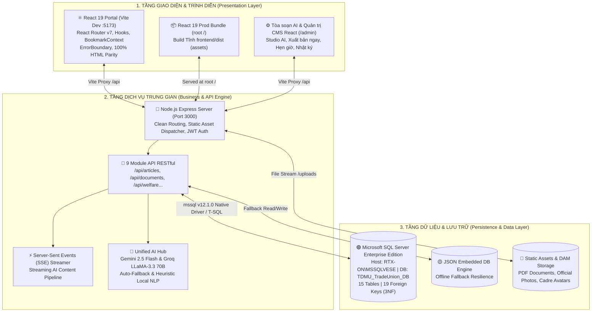

# 🇻🇳 HỆ THỐNG TRUYỀN THÔNG CÔNG ĐOÀN ĐẠI HỌC THỦ DẦU MỘT (TDMU) TÍCH HỢP TRÍ TUỆ NHÂN TẠO (AI)

[](https://react.dev/)
[](https://nodejs.org/)
[](https://www.microsoft.com/sql-server/)
[](https://ai.google.dev/)
[](#-4-kiến-trúc-cơ-sở-dữ-liệu-chuẩn-3nf-15-bảng--19-khóa-ngoại)
[](#-9-thông-tin-nhóm-thực-hiện)

> **BÁO CÁO ĐỀ TÀI NGHIÊN CỨU KHOA HỌC SINH VIÊN / ĐỒ ÁN CƠ SỞ NGÀNH**  
> **Đơn vị quản lý:** Viện Công Nghệ Số – Trường Đại Học Thủ Dầu Một (TDMU)  
> **Giảng viên hướng dẫn:** ThS. Võ Quốc Lương  
> **Nhóm sinh viên thực hiện (Nhóm 2):**
> 1. **Nguyễn Bình Dương** (Nhóm trưởng) – MSSV: `2424802010319` – Lớp: D24CNTT05
> 2. **Trần Hồng Thanh** – MSSV: `2424802010439` – Lớp: D24CNTT03
> 3. **Phạm Anh Tuấn** – MSSV: `2324802010393` – Lớp: D23CNTT03
> 
> **Mã nguồn GitHub:** [https://github.com/t5ry7y88889/CongDoanTDMU.git](https://github.com/t5ry7y88889/CongDoanTDMU.git)

---

## 📌 1. TỔNG QUAN DỰ ÁN

Hệ thống **Truyền Thông & Quản Trị Công Đoàn TDMU Tích Hợp Trí Tuệ Nhân Tạo (AI)** là giải pháp chuyển đổi số toàn diện được nghiên cứu và thiết kế chuyên biệt cho **Công đoàn Cơ sở Trường Đại học Thủ Dầu Một** (`congdoan.tdmu.edu.vn`).

Dự án giải quyết 4 bài toán cấp thiết trong quản trị và tuyên truyền đoàn thể giáo dục đại học:
1. **Kiến Trúc Kép Dual-Mode & Hiện Đại Hóa React 19 (Zero-Downtime)**:
   - Toàn bộ giao diện được dựng trên **React 19 + Vite 8 + React Router v7** với 2 ứng dụng: **Cổng thông tin Đoàn viên** (dev `:5173`, prod `:3000`) và **Tòa soạn / Quản trị CMS** (dev `:5184`, prod `/admin`). Không còn template tĩnh `admin.html` — toàn bộ admin là React SPA `frontend-admin`.
   - Cổng thông tin giữ 100% thiết kế báo chí truyền thống (HTML parity) với 5 component lõi thuần React Hooks, loại bỏ hoàn toàn các đoạn mã jQuery/Bootstrap DOM scanning gây xung đột.
   - Bổ sung chốt chặn lỗi cấp cao **`<ErrorBoundary>`** ngăn chặn triệt để hiện tượng trắng trang (white-screen crash).
2. **Số Hóa Quy Trình Tác Nghiệp & Báo Cáo Thi Đua**:
   - Tự động hóa công tác thu thập, tổng hợp số liệu báo cáo định kỳ tháng từ **16 Tổ Công đoàn trực thuộc** (khớp chuẩn Biểu mẫu `BM-02/CĐ`).
   - Quản lý hồ sơ nhân sự, lưu trữ công văn chỉ đạo DMS, tiếp nhận trực tuyến đơn đề nghị trợ cấp khó khăn và hòm thư góp ý phản ánh tâm tư đoàn viên.
3. **Tòa Soạn Số AI Content Studio & Quản Trị CMS (React `/admin`)**:
   - Ứng dụng mô hình ngôn ngữ lớn tiên tiến (**Google Gemini 2.5 Flash** & **Groq LLaMA 3.3 70B Versatile**) với luồng sinh nội dung **streaming (SSE)**, tạo bài báo chuẩn 5W1H (Sapo, thân bài phân mục H2) sẵn sàng xuất bản đồng bộ **Website / Facebook / Zalo**.
   - Shell quản trị React: Trợ lý AI biên tập đa nhà cung cấp (chọn provider + gợi ý khóa API), chế độ **Biên tập | Xem trước**, nút **🚀 Xuất bản ngay** (Website + tùy chọn Facebook/Zalo), cơ chế **⏰ Hẹn giờ** tự xuất bản và view **Lịch Xuất Bản** kèm **Nhật Ký Tác Nghiệp**.
4. **Kiến Trúc CSDL Quan Hệ Chuẩn 3NF (Microsoft SQL Server Enterprise)**:
   - Hệ thống gồm **15 bảng dữ liệu được liên kết chặt chẽ qua 19 khóa ngoại**, loại bỏ hoàn toàn bảng cô lập (orphan tables).
   - Vận hành với Transaction ACID, Prepared Statements chống SQL Injection và cơ chế bộ đệm dự phòng nhúng an toàn.

---

## 🏗️ 2. KIẾN TRÚC HỆ THỐNG (SYSTEM ARCHITECTURE)

Hệ thống vận hành song song theo mô hình **Dual-Mode Enterprise Architecture**:



---

## 🌟 3. CÁC PHÂN HỆ TÍNH NĂNG CHÍNH

### ⚛️ A. Cổng Thông Tin Đoàn Viên React 19 (SPA & 100% HTML Parity)
* **Khung Component Lõi Thuần React State**:
  1. **[`Navbar.jsx`](frontend/src/components/Navbar.jsx)**: Quản lý đóng/mở dropdown *"Cơ cấu tổ chức"* & *"Văn bản"* bằng React state, bắt sự kiện click-outside tự động đóng, menu Hamburger co giãn trên Mobile và badge hiển thị số bài đọc sau thời gian thực.
  2. **[`HeroCarousel.jsx`](frontend/src/components/HeroCarousel.jsx)**: Slider tin tức tự động chuyển slide sau mỗi 5000ms với hook dọn dẹp bộ nhớ (`clearInterval`), đầy đủ phím điều hướng Prev/Next và dãy chấm chỉ báo trạng thái.
  3. **[`PaginationBar.jsx`](frontend/src/components/PaginationBar.jsx)**: Phân trang chuẩn TOAST UI: dải số trang `[1] [2] [3]...`, nút First/Prev/Next/Last, bộ chọn số dòng (4, 8, 12, 24 bài/trang) và tóm tắt số lượng bản ghi.
  4. **[`ArticleQuickModal.jsx`](frontend/src/components/ArticleQuickModal.jsx)**: Modal xem nhanh toàn văn bài viết ngay trên trang chủ không cần chuyển trang.
  5. **[`BookmarksDrawer.jsx`](frontend/src/components/BookmarksDrawer.jsx)**: Ngăn kéo trượt từ mép phải (Right Drawer) hiển thị danh sách bài đọc sau, đồng bộ hai chiều với `localStorage` qua `BookmarkContext`.
* **Sao Chép 1:1 Thiết Kế Báo Chí Từ HTML Sang React**:
  - **Trang Tin tức (`TinTuc.jsx`)**: Giữ nguyên bài báo tiêu điểm Hero có chấm xanh nhấp nháy `live-dot` *"24 cán bộ đang đọc"*, hộp điểm nhấn AI 30 giây (`ai-takeaway-box`), lưới thẻ bài viết `.magazine-card` với hiệu ứng zoom ảnh mượt mà khi rê chuột.
  - **Cơ cấu tổ chức (`CoCauToChuc.jsx`)**: Thẻ `.cadre-card-item` kèm **ảnh chân dung thực tế** của 13 đồng chí Ban Chấp Hành, nhãn chức danh phân màu sắc (`tag-president`, `tag-vice-president`...), popup Modal lý lịch cán bộ chi tiết.
  - **Trang Đọc báo chi tiết (`BaiViet.jsx`)**: Khung bài báo `.article-main-container`, chữ cái đầu đoạn thụt dòng lớn (Drop Cap) chuẩn tòa soạn, **trình phát thanh giọng đọc tự động AI Voice (Web Speech API)**, các nút tương tác Thích / Vỗ tay / Lưu bài và bình luận trực tiếp.
  - **Trang Phúc lợi đoàn viên (`PhucLoiDoanVien.jsx`)**: 4 gói chăm lo chính sách (`welfare-card`), form nộp đơn đề nghị trợ cấp khó khăn trực tuyến với mã phiếu `#TC-xxx`.
  - **Kho Văn bản & Biểu mẫu (`VanBan.jsx`, `BieuMau.jsx`)**: Lọc và tìm kiếm tức thì theo số hiệu, trích yếu, người ký; đếm lượt tải file văn bản PDF và biểu mẫu Word.
  - **Hòm thư liên hệ (`LienHe.jsx`)**: Hòm thư điện tử tiếp nhận đóng góp ý kiến của đoàn viên gửi trực tiếp tới Ban Thường Vụ, cấp mã tiếp nhận `#FB-xxx`.

### 🤖 B. Tòa Soạn AI Content Studio & Quản Trị CMS (`/admin`) — React SPA `frontend-admin`
* **Shell quản trị React theo nhận diện Công đoàn:**
  - Thanh bên 3 nhóm **TỔNG QUAN / TRUYỀN THÔNG ĐA KÊNH / NGHIỆP VỤ CÔNG ĐOÀN**, logo Công đoàn, trình chọn vai trò (Quản Trị Viên / Biên Tập Viên / Cộng Tác Viên) và nút "Xem Website".
  - Header breadcrumb "Trang Quản Trị" + trạng thái Cổng Tác Nghiệp Đa Kênh.
* **Studio Sinh Bài AI (`Studio.jsx`):**
  - **Chọn nhà cung cấp AI** (Gemini / Groq / OpenRouter...) làm nguồn sinh; nhập chủ đề/sự kiện → AI sinh đồng bộ tiêu đề, sapo (lead) và thân bài chuẩn 5W1H.
  - **Gợi ý khóa API** ngay dưới ô chọn nhà cung cấp: khóa nhập tại ⚙️ (lưu trong trình duyệt) được ưu tiên hơn key trong `.env` (xem Bước 8).
  - Chế độ **Biên tập | Xem trước**: chuyển đổi chế độ soạn thảo sang khung xem trước bài viết trước khi xuất bản.
  - **🚀 Xuất bản ngay**: phát hành tức thì lên **Website** (mặc định) kèm tùy chọn **Facebook / Zalo**, ghi nhật ký qua `/api/publish/now`.
  - **⏰ Hẹn giờ**: lên lịch tự động xuất bản qua `/api/publish/schedule`; worker cron (30s) đăng bài đúng giờ.
  - Nút **Lưu nháp**: lưu bài về danh sách để tiếp tục biên tập sau.
* **View Lịch Xuất Bản (`Schedule.jsx`)**: theo dõi, hủy lịch hẹn giờ Website/Facebook/Zalo qua `/api/publish/schedules`.
* **View Nhật Ký Tác Nghiệp (`Audits.jsx`)**: truy vết thao tác biên tập, duyệt, xuất bản và xóa nội dung qua `/api/audits`.
* **Các phân hệ nghiệp vụ còn lại**: Bài viết (`Articles`), Văn bản (`Documents`), Biểu mẫu (`Templates`), Phúc lợi (`Welfare`), Góp ý (`Feedback`), Báo cáo tháng BM-02/CĐ (`Reports`), Người dùng (`Users`), Bảng điều khiển thống kê (`Dashboard`).

### 📊 C. Phân Hệ Quản Lý Báo Cáo Tháng & Thi Đua 16 Tổ Công Đoàn
* **Bảng tổng hợp KPI 16 Tổ CĐ:** Thống kê tổng số cán bộ, đoàn viên, đoàn viên nữ, mức xếp loại tự đánh giá và BTV đánh giá.
* **Biểu mẫu điện tử BM-02/CĐ:** Số hóa 5 phần nội dung báo cáo nộp trực tiếp về CSDL SQL Server kèm link minh chứng.

---

## 🗄️ 4. KIẾN TRÚC CƠ SỞ DỮ LIỆU CHUẨN 3NF (15 BẢNG & 19 KHÓA NGOẠI)

Cơ sở dữ liệu được thiết kế đạt chuẩn **Chuẩn hóa dạng 3 (3NF - Third Normal Form)**, loại bỏ triệt để các bất thường dị thường (anomalies) khi thêm, xóa, sửa. Toàn bộ 15 bảng đều được thiết lập mối liên kết toàn vẹn tham chiếu thông qua **19 Foreign Keys** (không tồn tại bảng mồ côi):

```text
                               +--------------------+
                               |      TO_CHUC       |
                               +--------------------+
                                         | 1
                                         | (MaToChuc)
                                         | n
    +--------------------+ 1    n +--------------------+ 1    n +--------------------+
    |    TO_CONG_DOAN    |--------|      NHAN_SU       |--------|      ARTICLES      |
    +--------------------+        +--------------------+        +--------------------+
              | 1                           | 1                   | 1    | 1     | 1
              | (MaToCongDoan)              |                     |      |       |
              | n                           |                     |      |       |
    +--------------------+                  |                     | n    | n     | n
    |  MONTHLY_REPORTS   |                  |                   +----+ +----+ +----+
    +--------------------+                  |                   |SCH | |COM | |BMK |
                                            |                   +----+ +----+ +----+
                                            |                     |      |      |
                                            |                     +------+------+
                                            |                            |
                                            | 1                          | n
                                            | (MaNhanSu)       +--------------------+
                                            +------------------|       USERS        |
                                                               +--------------------+
                                                                         | 1
                                                                         | n
                                                               +--------------------+
                                                               |   ARTICLE_AUDITS   |
                                                               +--------------------+

                 [ PHÂN HỆ CHĂM LO PHÚC LỢI & Ý KIẾN ĐOÀN VIÊN ]
            +--------------------+ 1          n +--------------------+
            |      PHUC_LOI      |--------------|    DON_TRO_CAP     |
            +--------------------+ (PhucLoiId)  +--------------------+
                                                          | n
                                                          | 1 (MaNhanSu)
                                                +--------------------+
                                                |      NHAN_SU       |
                                                +--------------------+
                                                          | 1
                                                          | n (UserId / MaNhanSu)
                                                +--------------------+
                                                |   INBOX_FEEDBACK   |
                                                +--------------------+
```

### 🏛️ Bảng Đặc Tả 15 Bảng Nghiệp Vụ Trong CSDL:

| STT | Tên Bảng | Mục Đích Nghiệp Vụ | Khóa Ngoại Liên Kết (FK) |
|:---:|:---|:---|:---|
| **1** | `TO_CHUC` | Quản lý 5 Ban cấp Trường (BTV, BCH, UBKT, Nữ công, Tuyên giáo) | Khóa chính tham chiếu bởi `NHAN_SU` |
| **2** | `TO_CONG_DOAN` | Danh mục 16 Tổ Công đoàn cơ sở trực thuộc | Khóa chính tham chiếu bởi `NHAN_SU`, `MONTHLY_REPORTS` |
| **3** | `NHAN_SU` | Danh bạ cán bộ, giảng viên, đoàn viên toàn trường | `MaToCongDoan` → `TO_CONG_DOAN`, `MaToChuc` → `TO_CHUC` |
| **4** | `CATEGORIES` | Danh mục chuyên đề bài báo và văn bản | Khóa chính tham chiếu bởi `ARTICLES` |
| **5** | `ARTICLES` | Bài viết, nội dung báo chí, đa kênh AI, cờ AI, lượt xem | `CategoryId` → `CATEGORIES`, `AuthorId` → `NHAN_SU` |
| **6** | `DOCUMENTS` | Văn bản chỉ đạo 4 loại (*Tuyên truyền, Kế hoạch, Luật, Quyết định*) | Độc lập danh mục văn bản ban hành |
| **7** | `MONTHLY_REPORTS` | Báo cáo tháng & Đánh giá thi đua 16 Tổ CĐ theo mẫu BM-02/CĐ | `MaToCongDoan` → `TO_CONG_DOAN` |
| **8** | `SCHEDULES` | Lịch hẹn giờ xuất bản bài tự động đa kênh | `ArticleId` → `ARTICLES` |
| **9** | `USERS` | Tài khoản xác thực & phân quyền 3 Role (`admin`, `editor`, `contributor`) | `MaNhanSu` → `NHAN_SU` |
| **10**| `ARTICLE_AUDITS`| Lịch sử tác nghiệp biên tập & dấu vết duyệt bài (audit lineage) | `ArticleId` → `ARTICLES`, `UserId` → `USERS` |
| **11**| `COMMENTS` | Ý kiến đóng góp & phản hồi của đoàn viên dưới bài viết | `ArticleId` → `ARTICLES`, `UserId` → `USERS` |
| **12**| `BOOKMARKS` | Tủ sách đọc sau cá nhân lưu trữ bài viết | `ArticleId` → `ARTICLES`, `UserId` → `USERS` |
| **13**| `PHUC_LOI` | Danh mục chính sách chăm lo (Quà Tết, Thai sản, Bệnh hiểm nghèo, Vay vốn) | Khóa chính tham chiếu bởi `DON_TRO_CAP` |
| **14**| `DON_TRO_CAP` | Đơn đề nghị hỗ trợ khó khăn & theo dõi phê duyệt giải ngân | `PhucLoiId` → `PHUC_LOI`, `MaNhanSu` → `NHAN_SU` |
| **15**| `INBOX_FEEDBACK`| Hòm thư tư liệu, góp ý, phản ánh tâm tư nguyện vọng gửi về BTV | `MaNhanSu` → `NHAN_SU`, `UserId` → `USERS` |

---

## 📡 5. DANH MỤC API ENDPOINTS CHÍNH THỨC

| Nhóm Nghiệp Vụ | Phương Thức | Endpoint URI | Chức Năng & Dữ Liệu |
|:---|:---:|:---|:---|
| **Tin Tức / Báo Chí** | `GET` | `/api/articles` | Lấy danh sách tin tức (Hỗ trợ lọc `status=published`, tìm kiếm) |
| | `GET` | `/api/articles/:id` | Lấy chi tiết 1 bài viết kèm nội dung đa kênh |
| | `POST` | `/api/articles` | Thêm bài viết mới vào CSDL |
| | `PUT` | `/api/articles/:id` | Chỉnh sửa nội dung / duyệt xuất bản bài viết |
| | `DELETE`| `/api/articles/:id` | Xóa bài viết (Kèm xóa Audit & Bookmark liên quan) |
| | `POST` | `/api/articles/:id/{approve,submit-review,reject}` | Quy trình duyệt bài biên tập |
| **AI Content Studio** | `POST` | `/api/ai/generate` | Sinh nội dung AI từ chủ đề |
| | `POST` | `/api/ai/package-stream` | Luồng SSE sinh gói tin tức đa kênh (streaming) |
| | `POST` | `/api/ai/generate-image` | Sinh ảnh minh họa báo chí |
| | `POST` | `/api/ai/repurpose` | Chuyển nội dung sang định dạng kênh (Facebook/Zalo/video) |
| | `POST` | `/api/ai/inline-edit` | Trợ lý chỉnh sửa inline văn bản |
| | `POST` | `/api/ai/chat`, `/api/ai/chat-stream` | Trợ lý AI hội thoại (streaming SSE) |
| | `POST` | `/api/ai/extract-facts`, `/quality-check`, `/floating-command` | Trích xuất sự kiện / rà soát chất lượng / lệnh nhanh |
| | `POST` | `/api/generate-article` | Bí danh (alias) của `/api/ai/package-generator` |
| **Xuất Bản Đa Kênh** | `POST` | `/api/publish/now` | Xuất bản ngay lên Website/Facebook/Zalo, ghi nhật ký |
| | `POST` | `/api/publish/schedule` | Hẹn giờ tự động xuất bản (cron 30s) |
| | `GET` | `/api/publish/schedules` | Danh sách lịch hẹn giờ xuất bản |
| | `DELETE` | `/api/publish/schedule/:id` | Hủy lịch hẹn giờ |
| | `GET` | `/api/publish/logs/:articleId` | Nhật ký xuất bản từng bài viết |
| **Kho Văn Bản** | `GET` | `/api/documents` | Lấy danh sách văn bản pháp quy (Phân loại, tìm kiếm) |
| | `POST` | `/api/documents/parse-docx` | Phân tích file DOCX thành văn bản |
| **Kho Biểu Mẫu** | `GET` | `/api/templates` | Danh mục biểu mẫu Word/Excel tải về |
| **Cơ Cấu Tổ Chức** | `GET` | `/api/org-full-tree` | Cây tổ chức đầy đủ (Ban, 16 Tổ CĐ, nhân sự & chức danh) |
| | `GET`/`POST`/`DELETE` | `/api/users` | Quản lý tài khoản xác thực & phân quyền |
| **Chăm Lo Phúc Lợi** | `GET` | `/api/welfare` | Danh mục 4 gói phúc lợi chính thức (`dbo.PHUC_LOI`) |
| | `POST` | `/api/welfare/apply` | Tiếp nhận đơn đề nghị trợ cấp vào `dbo.DON_TRO_CAP` |
| | `GET` | `/api/welfare/applications` | Danh sách đơn đề nghị trợ cấp chờ xét duyệt |
| **Hòm Thư Góp Ý** | `POST` | `/api/feedback` | Gửi thư góp ý, phản ánh trực tiếp tới Ban Thường Vụ |
| **Báo Cáo Tháng** | `GET` | `/api/monthly-reports` | Bảng tổng hợp thi đua và chi tiết báo cáo 16 Tổ |
| **Thống Kê / Giám Sát** | `GET` | `/api/audits` | Nhật ký tác nghiệp biên tập & duyệt bài |
| | `GET` | `/api/stats`, `/api/dashboard`, `/api/analytics` | Thống kê truy cập, tổng lượt xem, dashboard tổng quan |

---

## 💻 6. YÊU CẦU MÔI TRƯỜNG & CÔNG NGHỆ

* **Hệ điều hành:** Windows 10/11, macOS, hoặc Linux Ubuntu 22.04+.
* **Runtime:** Node.js `>= 18.x` (khuyến nghị Node.js LTS `v20.x`).
* **Hệ quản trị CSDL:** Microsoft SQL Server 2019 / 2022 (hoặc Azure SQL Database).
* **Gói thư viện phía Server:** `express`, `mssql`, `cors`, `dotenv`.
* **Gói thư viện phía Client:** `react` (^19.2.8), `react-dom` (^19.2.8), `react-router-dom` (^7.18.3), `vite` (^8.2.2).
* **Công cụ kiểm định mã nguồn (Linter):** `oxlint` (tốc độ cao, 0 errors).
* **Khóa API AI (Tùy chọn):** Google Gemini API Key và/hoặc Groq Cloud API Key (hệ thống có sẵn chế độ Fallback nếu không có internet hoặc thiếu key).

---

## 🚀 7. HƯỚNG DẪN CÀI ĐẶT & VẬN HÀNH HỆ THỐNG

### Bước 1: Tải mã nguồn từ GitHub
```bash
git clone https://github.com/t5ry7y88889/CongDoanTDMU.git
cd CongDoanTDMU
```

### Bước 2: Khởi tạo Cơ sở dữ liệu Microsoft SQL Server
1. Mở công cụ **SQL Server Management Studio (SSMS)** hoặc Azure Data Studio.
2. Tạo cơ sở dữ liệu mới (ví dụ: `TDMU_TradeUnion_DB`).
3. Mở và thực thi file kịch bản tạo 15 bảng:
   ```sql
   -- Thực thi file: database/schema_15_tables_mssql.sql
   ```
4. Mở và thực thi tiếp file nạp dữ liệu chuẩn:
   ```sql
   -- Thực thi file: database/seed_15_tables_mssql.sql
   ```

### Bước 3: Thiết lập biến môi trường (`.env`)
Copy chuẩn từ mẫu có sẵn (nằm tại thư mục gốc):
```bash
cp .env.example .env
```
```env
APP_NAME=Website_CongDoan_TDMU
PORT=3000

# Cấu hình Microsoft SQL Server (nếu không có SQL Server, giữ mặc định =>
# app tự động chạy chế độ JSON fallback tại server/database.json)
DB_SERVER=localhost
DB_HOST=127.0.0.1
DB_PORT=1433
DB_DATABASE=TDMU_TradeUnion_DB
DB_USER=sa
DB_PASSWORD=YourStrongPassword@2026

# Khóa API AI Studio (Tùy chọn — nếu bỏ trống, hệ thống Fallback local NLP)
GEMINI_API_KEY=AIzaSy...
GROQ_API_KEY=gsk_...
```

> **Ghi chú:** Tham khảo chi tiết cấu hình khóa AI tại **Bước 8** bên dưới (khóa ⚙️ trong trình duyệt được ưu tiên hơn khóa trong `.env`).

### Bước 4: Khởi động Production Server (Port 3000)
```bash
npm install
npm start
```
Khi kết nối thành công, màn hình console sẽ hiển thị:
```text
====================================================
🚀 Website Truyền Thông Công Đoàn TDMU Real SaaS Engine
🛰️  REST API:             http://localhost:3000
⚙️  React Admin (CMS):    http://localhost:3000/admin
🌐 Portal Đoàn viên:      http://localhost:3000
💻 Vite Dev Mode:         Portal :5173 | Admin :5184
====================================================
🟢 MICROSOFT SQL SERVER V2 LIVE CONNECTED!
🗄️ Database: TDMU_TradeUnion_DB @ localhost (15 Tables Connected)
====================================================
```

### Bước 5: DEV MODE — MỘT LỆNH DUY NHẤT
Chạy **một lệnh duy nhất từ thư mục gốc** để mở toàn bộ hệ thống (tự phát hiện cổng, không tạo tiến trình trùng):
```bash
npm run dev
```
Lệnh này tự khởi động (hoặc nhận diện & bỏ qua nếu đã chạy sẵn) 3 tiến trình dev:
| Tiến trình | Cổng | Vai trò |
| :--- | :--- | :--- |
| Express `server/server.js` | 3000 | REST API (`/api`, `/uploads`) + phục vụ bản build khi chạy production |
| Vite **portal** (`frontend/`) | 5173 | Cổng thông tin Đoàn viên (React, HMR) |
| Vite **admin** (`frontend-admin/`) | 5184 | Tòa soạn AI / Quản trị CMS (React, HMR) |

- Các frontend dùng `strictPort: true` → nếu cổng đã bị chiếm, lỗi hiện rõ thay vì tự nhảy sang port khác.
- Launcher không bắt buộc: bạn cũng có thể dùng `Chay_Website_CongDoan_TDMU.sh` (macOS/Linux) hoặc `.bat` (Windows) — nó chỉ chạy `npm run dev` và mở sẵn trình duyệt.
- Chạy **riêng backend** (khi cần tách process): `npm run dev:server` (cổng 3000).

### Bước 6: PROD MODE — MỘT URL DUY NHẤT (CHẠY BẢN BUILD)
Đóng gói cả hai React app rồi chạy gọn trên **một cổng 3000** (không cần Vite):
```bash
npm run build && npm run build:admin && npm run start
```
- `http://localhost:3000/` → Portal Đoàn viên (bản build React 19, SPA history fallback).
- `http://localhost:3000/admin` → React Admin Tòa soạn CMS (bản build, base `/admin/`).
- `npm run start` tương đương `npm run dev:server` — chỉ backend phục vụ mọi thứ.

### Bước 7: Kiểm thử & Chất lượng mã nguồn
```bash
npm test        # vitest + supertest (đơn vị & API integration, 15 test cases)
npm run lint    # oxlint 0 errors (portal frontend)
npm run db:reset  # (tùy chọn) Hạ & khởi tạo lại SQL Server schema 15 bảng + seed
```

### Bước 8: Cấu hình khóa API AI cho Tòa Soạn
Hệ thống AI dùng **Google Gemini** hoặc **Groq LLaMA**, hỗ trợ 2 cách cấp khóa:

| Cách cấp khóa | Nơi lưu | Ưu tiên | Khi nào có hiệu lực |
| :--- | :--- | :--- | :--- |
| **⚙️ Nút bánh răng (khuyến nghị)** | `localStorage` trình duyệt (cửa sổ `congdoan_admin_settings_v3`) | **Ưu tiên cao nhất**, gửi theo từng yêu cầu | **Tức thì (không cần khởi động lại)** |
| **`.env` (server)** | File `.env` ở thư mục gốc (`GEMINI_API_KEY` / `GROQ_API_KEY`) | Dùng khi không có khóa trong ⚙️ | **Chỉ sau khi khởi động lại server** |

Hướng dẫn:
1. Mở Tòa soạn → bấm biểu tượng **⚙️** → chọn nhà cung cấp AI → dán khóa API → lưu. Có hiệu lực ngay.
2. Hoặc đặt khóa trong `.env` rồi **khởi động lại server** (`Ctrl+C` rồi `npm start` / `npm run dev`).
3. Nếu AI báo *"Khóa API không hợp lệ hoặc đã bị thu hồi"*, kiểm tra: khóa đã nhập đúng chưa, hạn mức, hoặc ưu tiên của ⚙️ đang chặn key `.env` — chỉnh lại trong ⚙️ hoặc xóa nó để dùng key `.env`.
4. Khi chưa nhập khóa nào, hệ thống tự động dùng chế độ **Fallback NLP cục bộ** (sinh nội dung mẫu ngoại tuyến).

---

## 🧭 8. ĐỊA CHỈ TRUY CẬP CÁC PHÂN HỆ

> **Cheat-sheet nhanh:**
> - DEV  → `npm run dev` → mở `:5184` (Admin) + `:5173` (Portal), API ở `:3000`.
> - PROD → `npm run build && npm run build:admin && npm run start` → mọi thứ ở `:3000`.

| Phân Hệ | Cổng / URL | Mô Tả Kỹ Thuật |
| :--- | :--- | :--- |
| ⚛️ **Cổng Thông Tin Đoàn Viên (React 19)** | [http://localhost:5173](http://localhost:5173) | DEV mode: Single Page Application, 100% HTML parity, Virtual DOM, Client Routing (Vite + proxy `/api` sang Port 3000). |
| 🗄️ **Tòa Soạn / Quản Trị CMS (React)** | [http://localhost:5184](http://localhost:5184) | DEV mode: AI Content Studio + toàn bộ phân hệ nghiệp vụ (base `/admin/`, proxy `/api` sang Port 3000). |
| 🌐 **Cổng React SPA Production** | [http://localhost:3000](http://localhost:3000) | Bản build tĩnh (React 19) phục vụ tại root, SPA history fallback cho mọi đường dẫn. |
| ⚙️ **Quản Trị CMS Production** | [http://localhost:3000/admin](http://localhost:3000/admin) | Bản build React Admin (base `/admin/`) — thay thế hoàn toàn `admin.html` tĩnh đã gỡ bỏ. |
| 📊 **Báo Cáo Tháng 16 Tổ CĐ** | Trong React Admin → view **Reports** | Số hóa nộp mẫu BM-02/CĐ, đánh giá KPI & xếp loại thi đua trực tiếp về SQL Server. |

> **Lưu ý:** `:5173` cho Portal và `:5184` cho Admin chỉ tồn tại ở DEV mode (Vite HMR). Khi chạy bản build (`npm run start`), toàn bộ phân hệ nằm chung trên `:3000`.

---

## 📂 9. CẤU TRÚC THƯ MỤC DỰ ÁN

```text
tdmu-congdoan-web/
├── database/                                  # Cơ sở dữ liệu & Kịch bản SQL Server
│   ├── schema_15_tables_mssql.sql             # DDL Schema 15 bảng & 19 khóa ngoại chuẩn 3NF
│   ├── seed_15_tables_mssql.sql               # DML Seed nạp dữ liệu thực tế 16 Tổ CĐ & nghiệp vụ
│   └── migrations/                            # Bảng bổ sung (templates, publish_logs, welfare_contact...)
├── frontend/                                  # Cổng thông tin Đoàn viên (React 19 + Vite 8)
│   ├── src/
│   │   ├── pages/                             # 9 trang: Home, TinTuc, BaiViet, CoCauToChuc, VanBan, BieuMau, PhucLoiDoanVien, LienHe, GioiThieu
│   │   ├── components/                        # Navbar, HeroCarousel, PaginationBar, ArticleQuickModal, BookmarksDrawer, Footer
│   │   ├── App.jsx                            # React Router, ErrorBoundary & LinkInterceptor
│   │   └── main.jsx                           # Entry Point (ReactDOM.createRoot)
│   ├── vite.config.js                         # Cấu hình Vite & Proxy /api sang Port 3000
│   └── package.json
├── frontend-admin/                            # Tòa soạn AI & Quản trị CMS (React 19 + Vite 8)
│   ├── src/
│   │   ├── views/                             # Dashboard, Articles, Studio, Documents, Templates, Welfare, Feedback, Reports, Users, Schedule, Audits
│   │   ├── App.jsx                            # Shell: Sidebar, Settings (⚙️ API key), chế độ Xem trước
│   │   └── api.js                             # Client API helpers (AI, publish, upload)
│   ├── vite.config.js                         # base '/admin/', port 5184, proxy /api + /uploads + /images
│   └── package.json
├── public/                                    # Tài sản tĩnh phục vụ bởi Express
│   ├── images/                                # Logo, banner, ảnh báo chí (logo_cong_doan.png...)
│   └── uploads/                               # File do người dùng tải lên (PDF văn bản, ảnh...)
├── server/                                    # Tầng Dịch Vụ Backend (Node.js Express)
│   ├── server.js                              # Bootstrap + Cron Auto-Publish (chu kỳ 30s) phát hành lịch hẹn giờ
│   ├── app.js                                 # Express app: routes, phục vụ build React (/admin), uploads
│   ├── mssql_db.js                            # Module kết nối Microsoft SQL Server Enterprise
│   ├── db.js                                  # JSON Embedded Fallback Engine (loadDB/saveDB)
│   ├── routes/                                # 9 Module API (ai, articles, documents, welfare, feedback, publish, templates, reports, org)
│   ├── services/aiService.js                  # AI provider switching (Gemini/Groq) & fallback NLP
│   ├── middleware/validate.js                 # JoI validation schema
│   ├── database.json                          # Bộ dữ liệu đệm dự phòng (Fallback Engine)
│   ├── app.test.js                            # Vitest + Supertest (15 test cases)
│   └── scripts/init-db.js                     # Khởi tạo/reset SQL Server (npm run db:*)
├── scripts/                                   # serve-dev.js (orchestrator npm run dev), compose.mjs (Docker)
├── docs/                                      # Tài liệu đề tài (báo cáo docx, biểu đồ use-case)
├── compose.yaml                               # Docker Compose SQL Server 2022 cho môi trường phát triển
├── Chay_Website_CongDoan_TDMU.{sh,bat}        # Launcher một cú nhấp (DEV mode, tự mở trình duyệt)
├── .env.example                               # Mẫu cấu hình biến môi trường
├── .gitignore                                 # Khai báo loại trừ Git
├── package.json                               # Scripts: dev, build, start, test, lint, db:*
└── README.md                                  # Tài liệu kỹ thuật toàn diện của dự án
```

---

## 👥 10. THÔNG TIN NHÓM THỰC HIỆN

| Họ và Tên | Mã Số SV | Lớp Sinh Hoạt | Vai Trò & Phân Công Nhiệm Vụ |
|:---|:---:|:---:|:---|
| **Nguyễn Bình Dương** | `2424802010319` | D24CNTT05 | **Nhóm trưởng** - Phụ trách kiến trúc CSDL quan hệ 3NF (MSSQL), thiết kế Backend RESTful API, xây dựng AI Content Studio, luồng sinh nội dung streaming & trợ lý biên tập AI. |
| **Trần Hồng Thanh** | `2424802010439` | D24CNTT03 | **Thành viên** - Thiết kế giao diện Cổng thông tin đoàn viên (React 19 SPA & Portal), tối ưu hóa kiến trúc Dual-Mode, 100% HTML design parity, ErrorBoundary & hiệu năng. |
| **Phạm Anh Tuấn** | `2324802010393` | D23CNTT03 | **Thành viên** - Xây dựng phân hệ Quản lý Kho Văn bản pháp quy, Kho Biểu mẫu nghiệp vụ, Module số hóa Báo cáo Tháng BM-02/CĐ và tài liệu kiểm thử hệ thống. |

---

*© 2026 Nhóm 2 – Đồ án Cơ sở ngành / NCKH Sinh viên – Viện Công Nghệ Số, Trường Đại học Thủ Dầu Một.*
